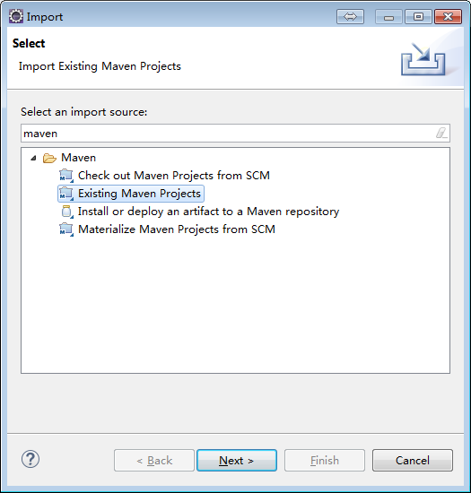
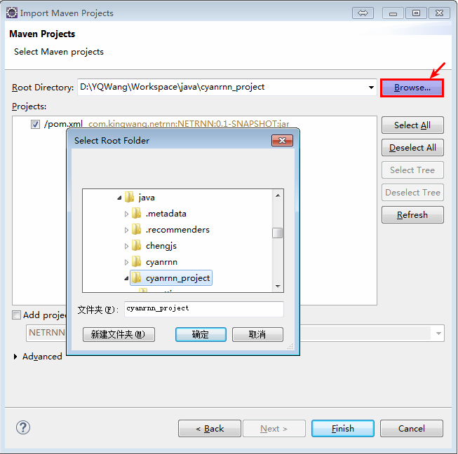
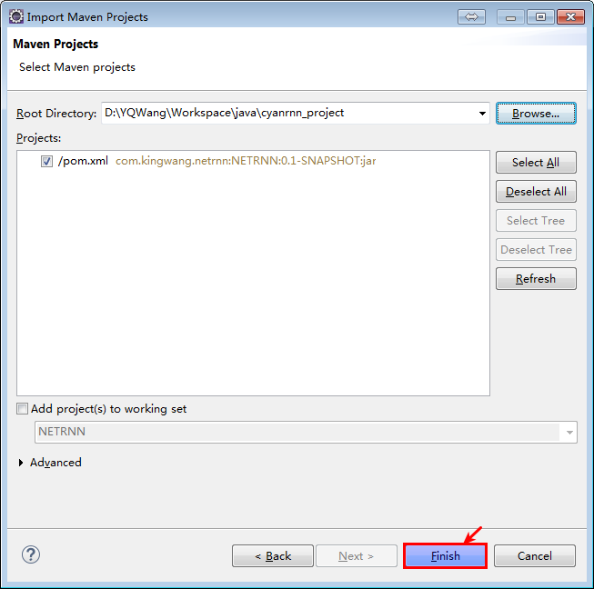
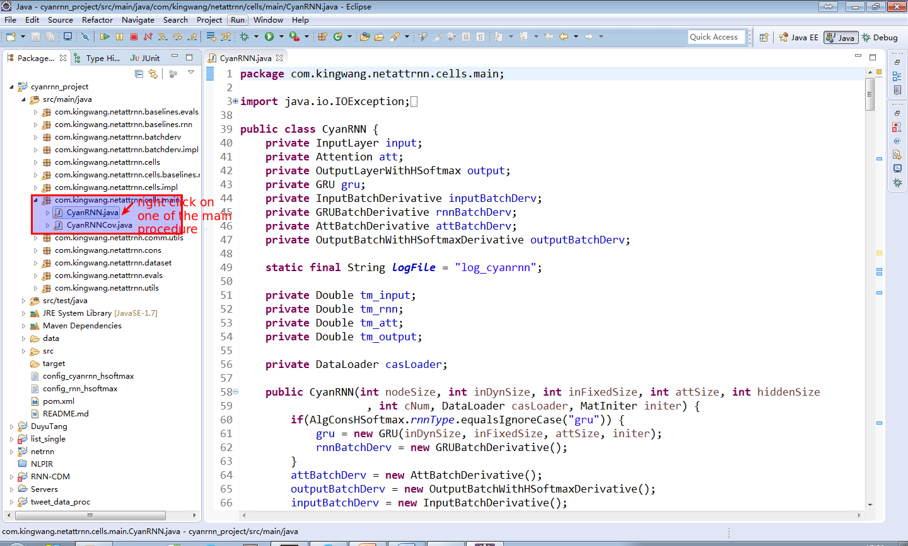
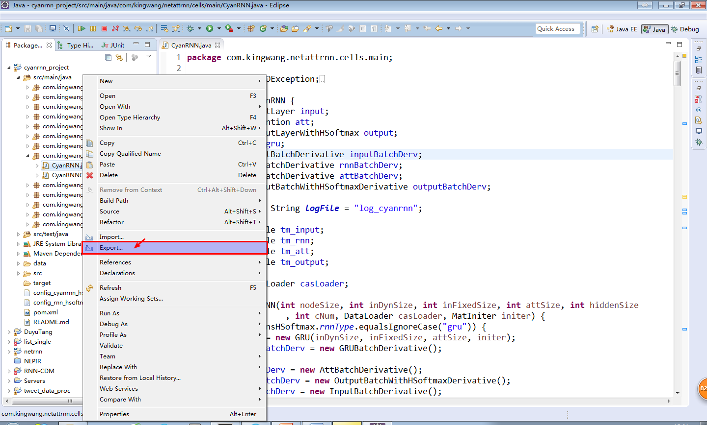
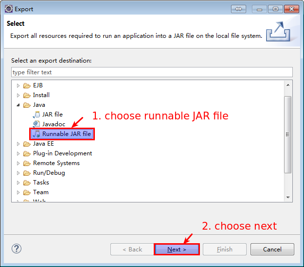
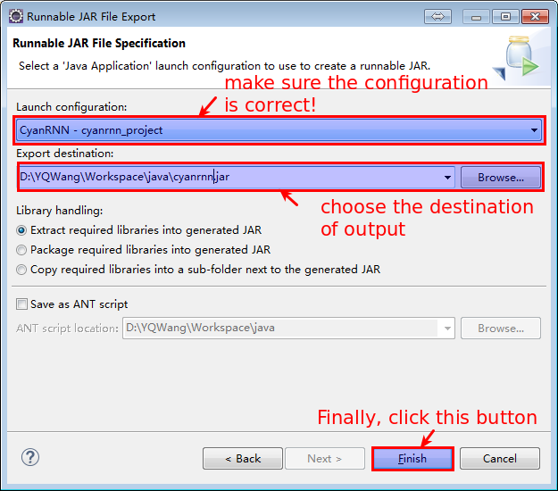

# CYAN-RNN

This repository enables the reproduction of the experiments described in the article:

[Yongqing Wang, Huawei Shen, Shenghua Liu, Jinhua Gao and Xueqi Cheng. Cascade dynamics modeling with attention-based recurrent neural network. The 26th International Joint Conference on Artificial Intelligence (IJCAI-17). Melbourne, Australia, 2017.](https://www.ijcai.org/proceedings/2017/0416.pdf)

The demo of this project is located in
[my personal website](http://yongqwang.com/public/res_dat/UAI_demo.tar.gz)

## Requirements

- maven==3.*
- jdk==1.8
- (optional) Eclipse
> must install maven plugin (the lastest version has already installed maven plugin)

## Usage

### Install the project

```bash
git clone git@github.com:Allen517/cyanrnn_project.git
cd cyanrnn_project
mvn clean install

```

### (Optional) Compile and packaging by Eclipse

* Import a project and import "Existing Maven Project"



* Click "Browse" and choose "cyanrnn_project"



* Click "Finish"



* Export a "Runnable JAR file"

> Right click on the main procedure



> Choose "Export"



> Choose "Runnable JAR file"



> Completed



### Running

```bash
java -jar cyanrnn.jar config_cyanrnn_hsoftmax

```
> move the runnable jar (e.g., the jar file is called "cyanrnn.jar") into the directory of cyanrnn_project

## Specfication

### The architecture of "src" directory

* main.java.com.kingwang.netattrnn

> baselines

>> evals

>> --RNNModelEvals.java: implementation of RNN validation in tranining process

>> rnn

>> --RNN.java: main process of RNN

> batchderv (When minibatch is finished, batchderv will average the derivation in all batches.)

>> BatchDerivative.java: interface of BatchDerivative

>> impl

>> --AttBatchDerivative.java: for attention layer

>> --AttWithCovBatchDerivative.java: for attention layer with coverage

>> --GRUBatchDerivative.java: for GRU (RNN)

>> --InputBatchDerivative.java: for input layer

>> --LSTMBatchDerivative.java: for LSTM (RNN)

>> --OutputBatchDerivative.java: for output layer

>> --OutputBatchWithHSoftmaxDerivative.java: for output layer with hierachical softmax

>> --OutputBatchWithOnlyTimeDerivative.java: for output layer (only calculating the generation of activated time)

>> --OutputBatchWithTimeDerivative.java: for output layer with hierachical softmax (calculating the generation of activated time and activated users)

> cells

> --Cell.java: interface of RNN layers

> --Operator.java: basic operator for RNN layers

>> baselines

>>> rnn/impl: implementation of RNN

>> impl: Implementation of CYAN-RNN and CYAN-RNN(cov)

>>> main: Main procedure of CYAN-RNN

> comm/utils: Common utilities

> cons: Constants

> dataset: Implementation of loading dataset

> evals: Implementation of CYAN-RNN and CYAN-RNN(cov) validation in tranining process
 
> utils: Common utilities for RNN, CYAN-RNN, CYAN-RNN(cov)
